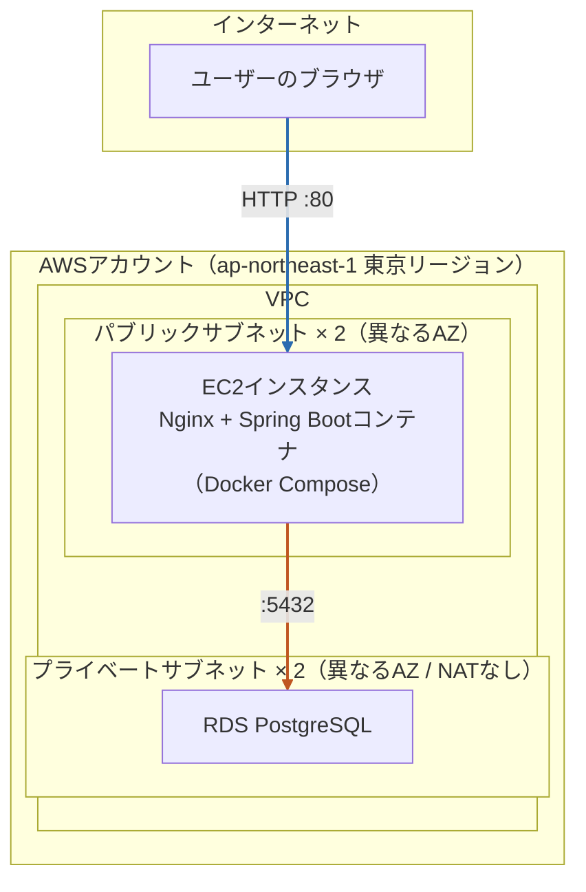
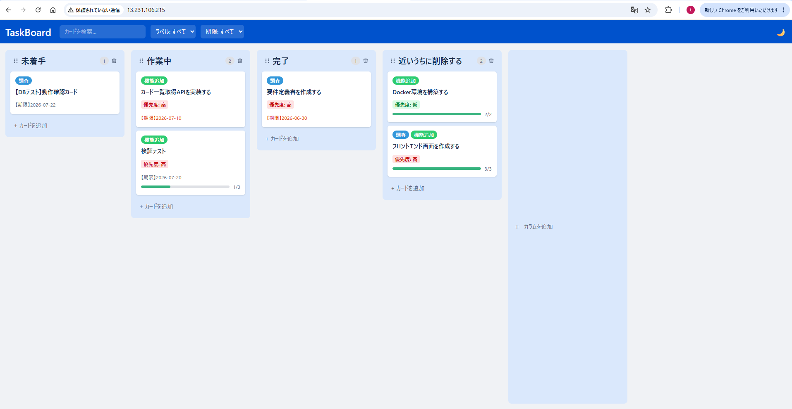
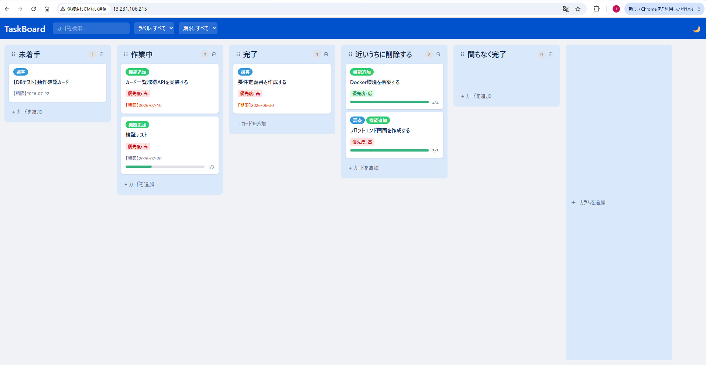
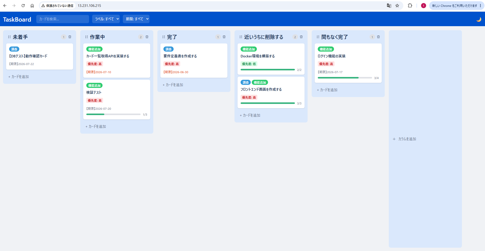
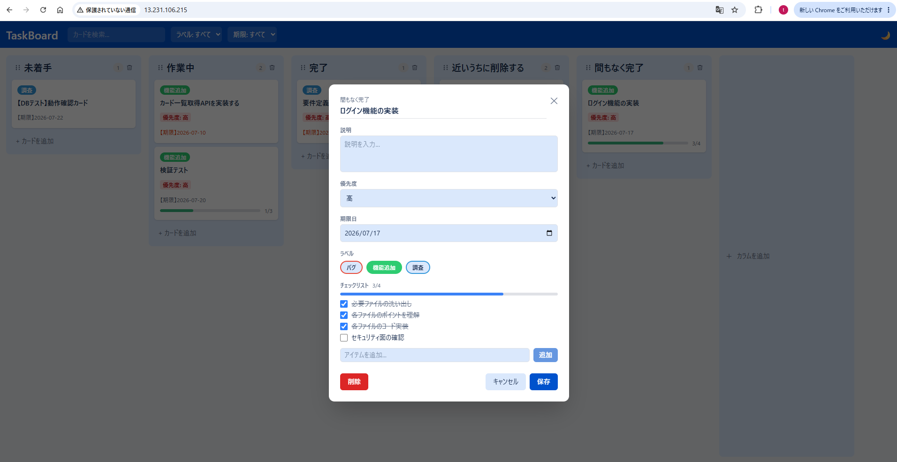
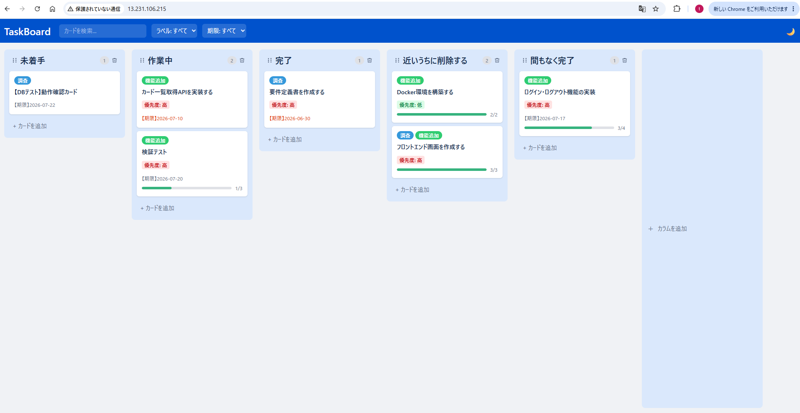
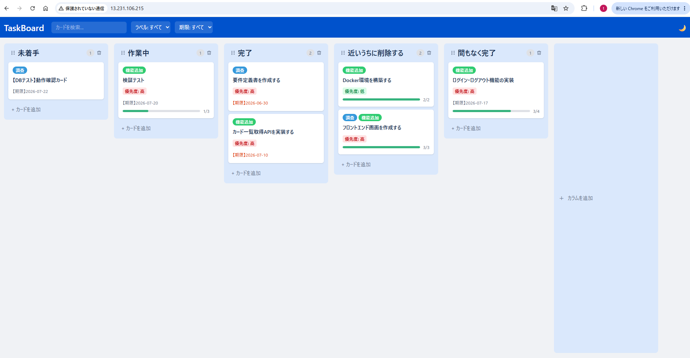
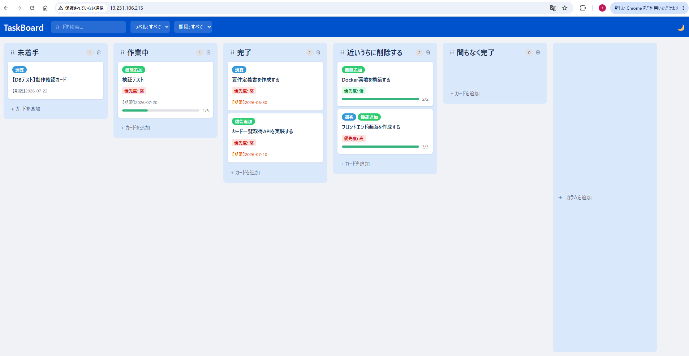
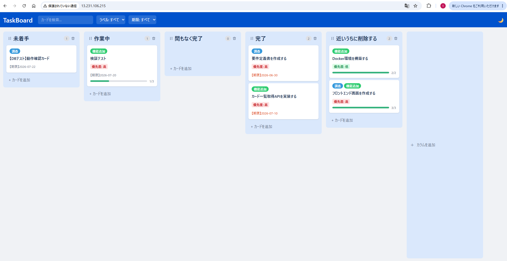

# タスク管理アプリ（Trelloライク カンバンボード）

React + Spring Boot + PostgreSQL によるフルスタックタスク管理アプリ。個人学習として、設計からAWSへのクラウドデプロイまで一通り実践しています。

---

## 概要

カンバン形式のタスク管理Webアプリです。カラム（リスト）とカード（タスク）をドラッグ&ドロップで操作でき、カードには説明・期限・ラベル・チェックリストを設定できます。

---

## インフラ構成

インフラはTerraformでコード管理しており、AWS（EC2 + RDS）上へのデプロイに対応しています。ALB・ECS Fargate等は使わず、EC2インスタンス1台に集約したシンプルな構成です。



> 通信の向きは「ブラウザ → EC2（HTTP :80）」「EC2 → RDS（PostgreSQL :5432）」の一方向です。RDSはプライベートサブネットに配置しており、ブラウザ（インターネット）から直接アクセスすることはできません。

構成の詳細（AWSリソース一覧・Terraformディレクトリ構成等）は [インフラ構成書](docs/infra-design.md) を参照してください。

---

## 技術スタック

詳細は [技術スタック・制約条件](docs/tech-stack.md) を参照してください。

### フロントエンド

| 区分 | 技術 | バージョン |
|------|------|-----------|
| 実行環境 | Node.js | 最新LTS版 |
| 言語 | TypeScript | 6.0.2 |
| フレームワーク | React | 19.2.6 |
| ビルドツール | Vite | 8.0.12 |
| スタイリング | Tailwind CSS | 4.3.1 |
| 状態管理 | Zustand | 5.0.14 |
| ドラッグ&ドロップ | dnd-kit | @dnd-kit/core 6.3.1 / @dnd-kit/sortable 10.0.0 |
| HTTPクライアント | Axios | 1.18.0 |

### バックエンド

| 区分 | 技術 | バージョン |
|------|------|-----------|
| 言語 | Java | 25 |
| フレームワーク | Spring Boot | 4.0.7 |
| APIスタイル | REST API | - |
| DB | PostgreSQL | 17 |
| ORM | Spring Data JPA / Hibernate | Spring Boot 4.0.7 同梱 |
| ビルドツール | Gradle | 9.1.0 |
| ユーティリティ | Lombok | Spring Boot 4.0.7 同梱 |

### インフラ

| 区分 | 技術 | 用途 |
|------|------|-----------|
| IaC | Terraform | AWSインフラのコード管理 |
| クラウド | AWS（EC2 / RDS / VPC） | アプリケーションの実行環境 |
| コンテナ | Docker / Docker Compose | アプリケーションのコンテナ化・実行 |
| Webサーバー | Nginx | 静的ファイル配信・APIリバースプロキシ |

---

## 主な機能

- **カラム管理**: 追加・削除・名前変更・ドラッグ&ドロップで並び替え
- **カード管理**: 作成・編集・削除・カラム間移動・カラム内並び替え
- **カード詳細**: 説明文・期限日・ラベル・チェックリスト
- **期限表示**: 期限日をカードに表示し、期限超過・期限間近を色分けして強調
- **ラベル**: 登録済みラベルのカードへの付与・解除、ラベルによる絞り込み
- **検索・フィルタ**: キーワード検索、ラベル・期限日フィルタ
- **ダークモード**: ライト/ダーク切り替え

---

## 動作画面

AWS（EC2 + RDS）上に実際にデプロイし、ブラウザから動作確認を行った際のスクリーンショットです。

| ボード初期表示 | カラム作成後 | カード作成後 | カード詳細 |
|---|---|---|---|
|  |  |  |  |

| カード編集後 | カード移動（D&D） | カード削除後 | カラム並び替え（D&D） |
|---|---|---|---|
|  |  |  |  |

---

## セットアップ

動作確認の方法は2通りあります。

1. **ローカル環境で動かす**（このREADMEの手順。AWSアカウント不要、すぐに試せる）
2. **AWS上にデプロイして動かす**（[AWSデプロイガイド](docs/aws-deployment/00-overview.md)の手順。Terraformで実際にAWS上にインフラを構築するため、AWSアカウントが必要で、稼働時間に応じた費用が発生する）

以降はローカル環境での手順です。リポジトリの取得からブラウザでの動作確認までを行えます。

### 前提条件

- Git
- Java 25
- Node.js（最新LTS版推奨）
- Docker / Docker Compose（PostgreSQLをコンテナで起動するため）

### 1. リポジトリの取得

```bash
git clone https://github.com/tomo-taka108/taskmanagement.git
cd taskmanagement
```

### 2. データベース起動

`.env.example`をコピーして`.env`を作成します。

```bash
cp .env.example .env
```

`.env`を開き、`DB_USERNAME`・`DB_PASSWORD`を**空欄のままにせず**値を設定してください（未設定だとPostgreSQLコンテナの初期化に失敗します）。バックエンド側のデフォルト値に合わせる場合は以下を設定します。

```
DB_USERNAME=taskuser
DB_PASSWORD=taskpass
```

Docker ComposeでPostgreSQLコンテナを起動します（`docker-compose.yml`はローカル開発用のPostgreSQLコンテナを定義しています）。

```bash
docker compose up -d
```

### 3. バックエンド起動

```bash
cd backend
./gradlew bootRun
```

> Windowsでコマンドプロンプト / PowerShellを使う場合は`gradlew.bat bootRun`を実行してください（Git Bash / Mac / Linuxでは`./gradlew bootRun`）。

起動後、`http://localhost:8080` でAPIが利用可能になります。
テーブル作成と初期データ投入は自動で行われます。

DB接続先はデフォルトで`jdbc:postgresql://localhost:5432/taskmanagement`（ユーザー名`taskuser`・パスワード`taskpass`）に接続する設定になっており、手順2で作成したPostgreSQLコンテナにそのまま接続できます。値を変更したい場合は、以下の環境変数で上書きできます。

```
DB_URL=jdbc:postgresql://localhost:5432/taskmanagement
DB_USERNAME=taskuser
DB_PASSWORD=taskpass
```

### 4. フロントエンド起動

```bash
cd frontend
npm install
npm run dev
```

起動後、ブラウザで `http://localhost:5173` を開くとアプリの画面が表示され、カードの作成・編集・ドラッグ&ドロップ移動などの操作を確認できます。

---

## ポート構成

| サーバー | URL |
|---------|-----|
| フロントエンド | http://localhost:5173 |
| バックエンド API | http://localhost:8080 |

> バックエンドのCORS設定はポート5173のみ許可しています。ポートを変更すると動作しません。

---

## AWS上にデプロイして動かす

Terraformで実際にAWS（EC2 + RDS）上にインフラを構築し、ブラウザから動作確認することもできます。概要は以下の流れです（詳細な手順・前提条件は [AWSデプロイガイド](docs/aws-deployment/00-overview.md) を参照）。

> [AWSデプロイガイド](docs/aws-deployment/00-overview.md)内のコマンドはWindows（PowerShell）での実行を前提に記載しています。Mac/Linuxの場合は`scp`・`ssh`・`terraform`など各コマンド自体は同様に利用できますが、記載コマンドの一部（改行・変数展開等のシェル構文）を実行環境に合わせて読み替えてください。

```
1. AWSアカウントを準備し、AWS CLIをセットアップする
2. cd infra/envs/dev && terraform apply でVPC・EC2・RDSを構築する
3. terraform output でEC2のパブリックIP・RDSエンドポイントを取得する
4. フロントエンドをビルドし、バックエンド・Nginx設定とともにEC2へ転送する
5. EC2上で docker compose up -d --build を実行し、コンテナを起動する
6. ブラウザで http://<EC2のパブリックIP>/ にアクセスして動作確認する
```

AWSリソースは稼働時間に応じて課金されるため、動作確認後は`terraform destroy`で削除する運用を前提としています（コスト方針は [インフラ構成書](docs/infra-design.md) を参照）。

---

## ドキュメント

| ドキュメント | 内容 |
|------------|------|
| [要件定義書](docs/requirements.md) | プロジェクト概要・スコープ・開発フェーズ |
| [機能要件・非機能要件](docs/functional-requirements.md) | 機能一覧・受入条件・非機能要件 |
| [画面設計書](docs/screen-design.md) | 画面一覧・画面遷移図・レイアウト詳細 |
| [データベース設計書](docs/database-design.md) | ER図・テーブル定義 |
| [API設計書](docs/api-design.md) | エンドポイント一覧・HTTPステータスコード規則 |
| [技術スタック・制約条件](docs/tech-stack.md) | 使用技術バージョン・実行環境・制約 |
| [インフラ構成書](docs/infra-design.md) | AWSアーキテクチャ・リソース一覧・Terraform/アプリのディレクトリ構成 |
| [AWSデプロイガイド](docs/aws-deployment/00-overview.md) | AWS・Terraform初学者向けのデプロイ手順一式 |

---

## ディレクトリ構成

```
TaskManagement/
├── backend/                  # Spring Boot アプリ
│   ├── Dockerfile            # 本番用イメージビルド定義
│   └── src/
│       └── main/
│           ├── java/         # Javaソースコード
│           └── resources/
│               ├── application.yml
│               └── data.sql  # 初期データ
├── frontend/                 # React アプリ
│   └── src/
├── infra/envs/dev/           # Terraformコード（AWS: VPC/EC2/RDS等）
├── nginx/                    # 本番用Nginx設定（静的配信 + リバースプロキシ）
├── docker-compose.yml        # ローカル開発用
├── docker-compose.prod.yml   # 本番（EC2）用
├── docs/                     # 設計ドキュメント・AWSデプロイガイド
└── .github/                  # Issue・PRテンプレート
```
