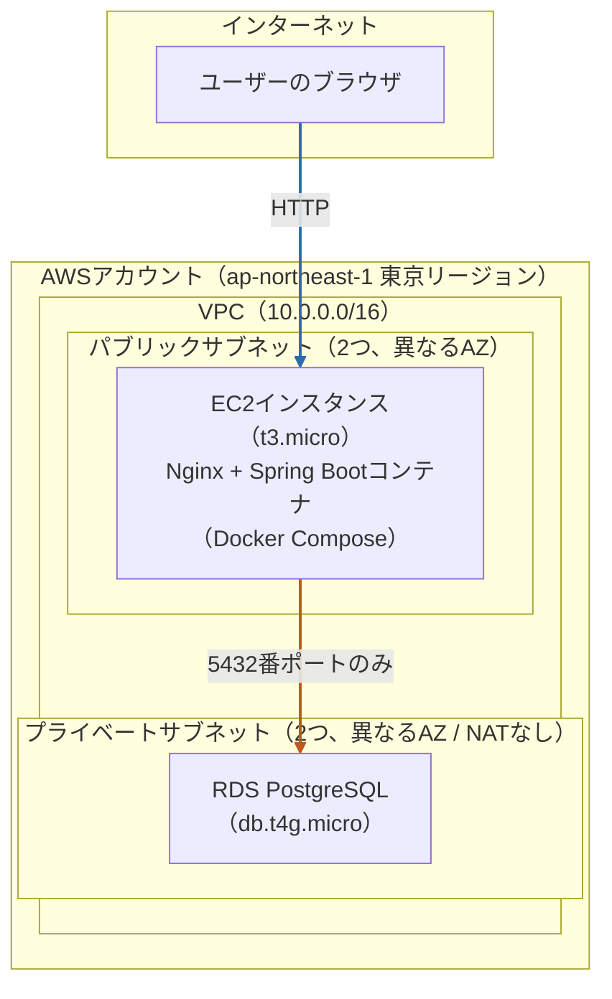

# 00. 全体像 — このアプリをAWSにデプロイするとは何をすることか

このドキュメント群は、AWS・Terraformが**まったくの初めて**という前提で書かれています。
最終的に、このタスク管理アプリ（Spring Boot バックエンド + React フロントエンド）を、
AWSのマネジメントコンソール（ブラウザのポチポチ操作画面）を一切使わず、
**コマンドラインだけ**でAWS上にデプロイできるようにします。

読み進める順番は以下の通りです。

1. `00-overview.md`（このファイル）— 全体像と用語のざっくり把握
2. `01-aws-account-setup.md` — AWSアカウントを作る（手動作業）
3. `02-cli-setup.md` — 手元のPCからAWSを操作できるようにする（手動＋コマンド）
4. `03-terraform-basics.md` — Terraformとは何か、IaCとは何か
5. `04-infra-design.md` — 今回使うAWSサービスが何をするものか
6. `05-deploy-procedure.md` — 実際にデプロイするコマンド手順
7. `06-app-changes.md` — アプリのコードに加えた変更点の解説
8. `07-cost-management.md` — お金の話（超重要）
9. `08-troubleshooting.md` — つまずいたときの対処法

---

## 1. そもそも「デプロイする」とはどういうことか

いま、あなたのアプリはあなたのPC上でしか動いていません。
`localhost:8080`（バックエンド）と`localhost:5173`（フロントエンド）は、
どちらも「このPCの中だけで見える住所」です。他の人はアクセスできません。

「デプロイする」とは、これを**インターネット上の誰かが借りているコンピュータ**の上で動かし、
世界中からアクセスできるURLを与えることです。AWSは、そのための「コンピュータを借りる先」の代表格です。

## 2. なぜ「マネジメントコンソールを手で操作」しないのか

AWSには通常、ブラウザ上の管理画面（マネジメントコンソール）があり、
ボタンをクリックしてサーバーを立てたりデータベースを作ったりできます。
初心者向けの入門記事の多くはこの方法を使います。

しかし今回は**あえてそれを避け**、すべてコマンド（AWS CLIとTerraform）で行います。理由は次の通りです。

| 観点 | コンソール手動操作 | CLI + Terraform（今回採用） |
|---|---|---|
| 再現性 | 同じ環境をもう一度作るのが大変（手順を忘れる、押し忘れる） | コードなので誰が実行しても同じ結果になる |
| 記録 | 「何をクリックしたか」が残らない | コードがそのままGitで履歴管理される |
| レビュー | 変更内容を他人が確認しづらい | コードの差分（diff）としてレビューできる |
| 学習効果 | 「魔法のボタン」を押しただけになりがち | 何が作られているかを構成として理解できる |
| 削除・後片付け | 作ったものを手動で全部探して消す必要がある | `terraform destroy`一発で全部消せる |

特に最後の「削除のしやすさ」は個人学習では地味に重要です。
コンソールでポチポチ作ったリソースは消し忘れて課金が続く事故が起きがちですが、
Terraformで作ったものはコマンド一発で綺麗に消せます。

## 3. 全体アーキテクチャ

今回構築する構成の全体像です。**個人利用・認証なし**という前提のもと、無料利用枠に収まることを最優先し、
一般的なWebアプリ構成（ALB、ECS Fargate、S3+CloudFront等）はあえて採用せず、
**EC2インスタンス1台に集約したシンプルな構成**にしています。

- **フロントエンド**（React）: ビルドした静的ファイル（HTML/CSS/JS）をEC2上のNginxコンテナが直接配信
- **バックエンド**（Spring Boot）: Dockerコンテナ化し、同じEC2上でDocker Composeにより実行。NginxがリバースプロキシとしてAPIリクエストを振り分ける
- **データベース**: RDS（マネージドPostgreSQL）。外部から直接繋がせず、EC2からのみアクセス可能にする

ALB・ECS Fargate・ECR・S3・CloudFrontは使いません。理由は「4. 今回のコスト方針」で説明します。

## 4. 今回のコスト方針

個人利用・認証なしのアプリであり、**お金をかけすぎない**ことを最優先します。具体的には以下の工夫をしています。

- **ALBを使わない**: ALBは起動しているだけで月$16〜17かかり、今回の構成で最もコストが高くなる要因のため廃止。EC2に直接アクセスする構成にする
- **ECS Fargateを使わない**: EC2 1台（`t3.micro`）に集約することで、AWS無料利用枠（新規アカウントから12ヶ月間、`t2.micro`または`t3.micro`が750時間/月無料）の対象にする
- **S3 + CloudFrontを使わない**: フロントエンドの静的ファイルもEC2上のNginxで配信し、CDN・追加のストレージ費用を発生させない
- **NAT Gateway（月$30以上する高額なリソース）を使わない構成にする**
- RDSは`db.t4g.micro`を使い、無料利用枠（750時間/月、12ヶ月間）の対象にする
- 独自ドメイン・HTTPS証明書（ACM）は使わず、HTTPのみで済ませる
- **使わないときは`terraform destroy`で全部消す**運用を前提にする

詳しいコスト試算は `07-cost-management.md` で解説します。

## 5. 用語のざっくり対応表

まだピンとこない用語も、読み進めれば`04-infra-design.md`で1つずつ解説します。ここでは「何のためにあるか」だけ先に掴んでください。

| 用語 | ざっくり言うと |
|---|---|
| AWS CLI | ターミナルからAWSを操作するためのコマンドツール |
| Terraform | インフラの構成を「コード」として書き、その通りにAWS上へ構築してくれるツール |
| IaC（Infrastructure as Code） | インフラをコードで管理する考え方全般。Terraformはその実現手段の1つ |
| IAM Identity Center | AWSへのログイン・権限管理の仕組み（旧AWS SSO） |
| VPC | AWS上に作る「自分専用の仮想ネットワーク」 |
| サブネット | VPCの中をさらに区切った小さな区画 |
| EC2 | 仮想サーバー1台を借りられるサービス。今回はこの1台にDockerでフロント・バックエンドをまとめて動かす |
| Docker / Docker Compose | アプリを「コンテナ」という単位で動かす仕組み。Composeは複数コンテナ（Nginx・Spring Boot）をまとめて起動・管理するツール |
| RDS | マネージドなデータベース（PostgreSQLなどをAWSが運用してくれる） |
| Nginx | Webサーバー・リバースプロキシ。今回はフロントの静的ファイル配信とバックエンドAPIへの振り分けを担当 |

---

次は `01-aws-account-setup.md` に進み、実際にAWSアカウントを作成するところから始めます。
