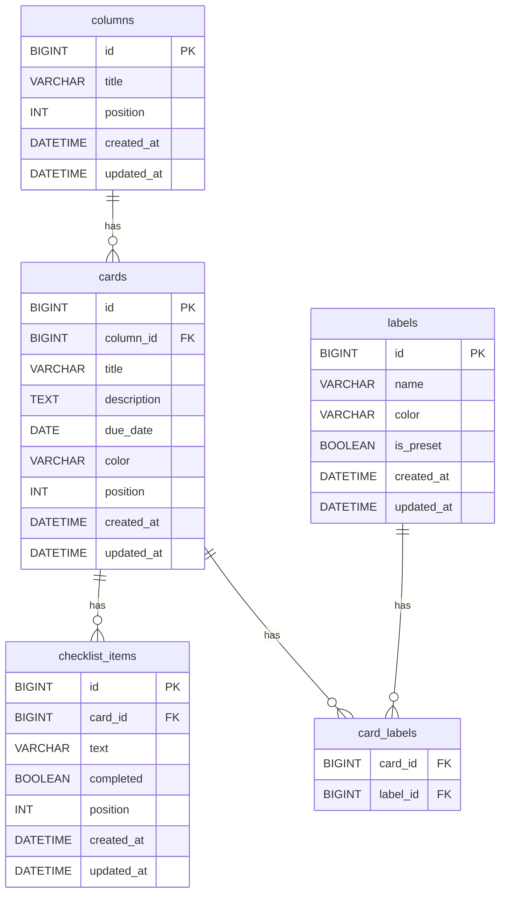

# データベース設計書

**バージョン:** 0.1  
**作成日:** 2026-06-13  
**作成者:** tomo-taka108

---

## 1. ER図

---

## 2. テーブル定義

### 2.1 columns（カラム）

| カラム名 | 型 | 制約 | 説明 |
|----------|-----|------|------|
| id | BIGINT | PK, AUTO_INCREMENT | カラムID |
| title | VARCHAR(255) | NOT NULL | カラム名 |
| position | INT | NOT NULL | 表示順序 |
| created_at | DATETIME | NOT NULL | 作成日時 |
| updated_at | DATETIME | NOT NULL | 更新日時 |

### 2.2 cards（カード）

| カラム名 | 型 | 制約 | 説明 |
|----------|-----|------|------|
| id | BIGINT | PK, AUTO_INCREMENT | カードID |
| column_id | BIGINT | FK (columns.id), NOT NULL | 所属カラムID |
| title | VARCHAR(255) | NOT NULL | カードタイトル |
| description | TEXT | NULL | 説明文 |
| due_date | DATE | NULL | 期限日 |
| color | VARCHAR(50) | NULL | カード背景色 |
| position | INT | NOT NULL | カラム内表示順序 |
| created_at | DATETIME | NOT NULL | 作成日時 |
| updated_at | DATETIME | NOT NULL | 更新日時 |

### 2.3 labels（ラベル）

| カラム名 | 型 | 制約 | 説明 |
|----------|-----|------|------|
| id | BIGINT | PK, AUTO_INCREMENT | ラベルID |
| name | VARCHAR(100) | NOT NULL | ラベル名 |
| color | VARCHAR(50) | NOT NULL | ラベル色 |
| is_preset | BOOLEAN | NOT NULL, DEFAULT false | プリセットラベルフラグ |
| created_at | DATETIME | NOT NULL | 作成日時 |
| updated_at | DATETIME | NOT NULL | 更新日時 |

### 2.4 card_labels（カード-ラベル中間テーブル）

| カラム名 | 型 | 制約 | 説明 |
|----------|-----|------|------|
| card_id | BIGINT | PK, FK (cards.id) | カードID |
| label_id | BIGINT | PK, FK (labels.id) | ラベルID |

### 2.5 checklist_items（チェックリスト項目）

| カラム名 | 型 | 制約 | 説明 |
|----------|-----|------|------|
| id | BIGINT | PK, AUTO_INCREMENT | 項目ID |
| card_id | BIGINT | FK (cards.id), NOT NULL | 所属カードID |
| text | VARCHAR(500) | NOT NULL | 項目テキスト |
| completed | BOOLEAN | NOT NULL, DEFAULT false | 完了フラグ |
| position | INT | NOT NULL | 表示順序 |
| created_at | DATETIME | NOT NULL | 作成日時 |
| updated_at | DATETIME | NOT NULL | 更新日時 |

---

## 3. 設計補足

| テーブル | 補足 |
|----------|------|
| columns | ボード固定のため board_id は不要。並び順は `position` で管理 |
| cards | 所属カラムを `column_id` で管理。カラム移動時に `column_id` と `position` を更新 |
| labels | アプリ全体で共通管理。`is_preset = true` はプリセットラベル |
| card_labels | カードとラベルの多対多を解消する中間テーブル |
| checklist_items | カード単位で管理。並び順は `position` で管理 |
