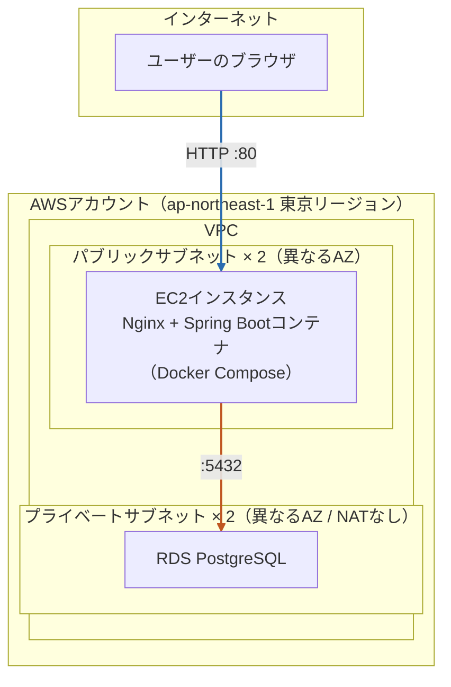

# インフラ構成書

**バージョン:** 0.1
**作成日:** 2026-07-12
**作成者:** tomo-taka108

---

## 1. 位置づけ

本ドキュメントは、本アプリケーションをAWS上にデプロイする際のインフラ構成のスナップショットをまとめたものです。

- Terraformコード一式は [`infra/envs/dev/`](../infra/envs/dev/) にあり、実際の構成の**正**（source of truth）はコード側です。本書は全体像を把握するための要約であり、詳細な設定値（CIDR、インスタンスタイプ等の具体的な値）は変更される可能性があるため最小限の記載に留めています。正確な値は都度Terraformコード（`variables.tf`等）を参照してください。
- AWS・Terraformの初学者向けの詳しい解説（用語説明・手順・コスト試算・トラブルシューティング等）は [`docs/aws-deployment/`](aws-deployment/) 配下の各ドキュメントを参照してください。本書はその要約版という位置づけです。

---

## 2. アーキテクチャ概要

個人利用・無認証アプリという前提のもと、**コストを最小限に抑えることを最優先**し、ALB・ECS Fargate・S3+CloudFront等は使わず、**EC2インスタンス1台に集約したシンプルな構成**を採用しています。



| 層 | 役割 |
|---|---|
| フロントエンド（React） | ビルド成果物（静的ファイル）をEC2上のNginxコンテナが配信 |
| バックエンド（Spring Boot） | Dockerコンテナ化し、同一EC2上でDocker Composeにより実行。Nginxがリバースプロキシとして`/api`宛のリクエストを振り分け |
| データベース | RDS（マネージドPostgreSQL）。プライベートサブネットに配置し、EC2からのみアクセス可能 |

### 採用しなかった構成とその理由

| 不採用の構成 | 理由 |
|---|---|
| ALB | 常時起動コストが最も高いリソースの1つのため |
| ECS Fargate | EC2 1台に集約することでコストを抑えるため |
| S3 + CloudFront | フロントエンドもEC2上のNginxで配信し追加コストを避けるため |
| NAT Gateway | 常時起動コストが高いため。RDSをプライベートサブネットに置きつつ、外向き通信を持たせない設計で代替 |
| 独自ドメイン・ACM（HTTPS） | HTTPのみで済ませ、コストと構築の複雑さを避けるため |

コストの詳細な試算・運用方針は [`docs/aws-deployment/07-cost-management.md`](aws-deployment/07-cost-management.md) を参照してください。

---

## 3. AWSリソース構成

| リソース | 役割 | 配置 |
|---|---|---|
| VPC | 専用の仮想ネットワーク | - |
| パブリックサブネット × 2 | EC2を配置（異なるAZ） | VPC内 |
| プライベートサブネット × 2 | RDSを配置（異なるAZ、RDSのサブネットグループ要件を満たすため） | VPC内 |
| インターネットゲートウェイ | VPCとインターネットの接続点 | VPCにアタッチ |
| ルートテーブル | パブリックサブネットの通信をIGW経由に設定 | パブリックサブネットに関連付け |
| セキュリティグループ（EC2用） | HTTP(80)を全世界に許可、SSH(22)を自分のIPのみ許可 | EC2にアタッチ |
| セキュリティグループ（RDS用） | PostgreSQL(5432)をEC2用SGからのみ許可 | RDSにアタッチ |
| EC2インスタンス | Nginx + Spring BootコンテナをDocker Composeで実行（起動時`user_data`でDocker自動導入） | パブリックサブネット |
| キーペア | EC2へのSSH接続用（Terraformが生成） | - |
| RDS（PostgreSQL） | アプリケーションのデータ永続化 | プライベートサブネット |
| DBサブネットグループ | RDSを配置するサブネットの組 | プライベートサブネット × 2 |

各リソースの役割の詳しい解説は [`docs/aws-deployment/04-infra-design.md`](aws-deployment/04-infra-design.md) を参照してください。

---

## 4. Terraformディレクトリ構成

```
infra/
└── envs/
    └── dev/                        # 環境ごとのディレクトリ（現状はdevのみ）
        ├── versions.tf             # Terraform / プロバイダのバージョン制約
        ├── providers.tf            # AWSプロバイダ設定
        ├── variables.tf            # 変数定義（リージョン、CIDR、インスタンスタイプ等）
        ├── vpc.tf                  # VPC
        ├── subnets.tf              # パブリック/プライベートサブネット
        ├── route_tables.tf         # ルートテーブル・IGW関連付け
        ├── security_groups.tf      # EC2用/RDS用セキュリティグループ
        ├── key_pair.tf             # EC2用SSHキーペア
        ├── ec2.tf                  # EC2インスタンス（AMI取得・Docker導入含む）
        ├── rds.tf                  # RDS（PostgreSQL）・DBサブネットグループ
        ├── outputs.tf              # apply後に取得できる出力値（EC2 IP、RDSエンドポイント等）
        ├── terraform.tfvars.example  # tfvarsのひな形（Gitで管理）
        └── terraform.tfvars        # 実際の値（機密情報を含むためGit管理対象外）
```

- 環境は現状`dev`のみですが、将来的に環境を追加する場合は`infra/envs/<環境名>/`を追加する想定です。
- `terraform.tfvars`・`*.tfstate`・`.terraform/`・`*.pem`（生成されるSSH秘密鍵）はいずれも機密情報またはローカル状態のため`.gitignore`で除外しています。

デプロイ手順の詳細は [`docs/aws-deployment/05-deploy-procedure.md`](aws-deployment/05-deploy-procedure.md) を参照してください。

---

## 5. アプリケーション側の構成

デプロイに伴い、リポジトリルートに以下のファイルを追加しています。

```
TaskManagement/
├── docker-compose.yml         # ローカル開発用（PostgreSQLコンテナ等）
├── docker-compose.prod.yml    # 本番（EC2）用。backend・nginxの2サービスを定義
├── nginx/
│   └── nginx.conf             # フロントエンド静的配信 + /api・/actuator リバースプロキシ設定
├── backend/
│   └── Dockerfile             # Spring Bootの実行用イメージ（JREベース）
└── frontend/
    └── src/vite-env.d.ts      # VITE_API_BASE_URL等のビルド時環境変数の型定義
```

| サービス | イメージ | 役割 |
|---|---|---|
| `backend` | `backend/Dockerfile`からビルド | Spring Boot API。コンテナ間ネットワークのみに公開（ホストOSには非公開） |
| `nginx` | `nginx:1.27-alpine` | フロントエンド静的ファイル配信 + `/api`・`/actuator`宛リクエストを`backend`へリバースプロキシ。80番ポートをEC2に公開 |

アプリケーションコード側の変更点（CORS設定・APIクライアントのbaseURL環境変数化等）の詳細は [`docs/aws-deployment/06-app-changes.md`](aws-deployment/06-app-changes.md) を参照してください。

---

## 6. 動作確認・運用状況

実際にEC2+RDS上にデプロイし、ブラウザからCRUD操作（カラム・カード作成、詳細表示・編集、ドラッグ&ドロップ移動、削除等）が正常に動作することを確認済みです。動作確認時のスクリーンショットは [README.md](../README.md#動作画面) を参照してください。

コスト管理方針として、動作確認後は`terraform destroy`でAWSリソースを削除する運用としています。次回デプロイする際は`terraform apply`から再構築します（詳細は[`docs/aws-deployment/07-cost-management.md`](aws-deployment/07-cost-management.md)を参照）。

---

## 7. 関連ドキュメント

| ドキュメント | 内容 |
|---|---|
| [docs/aws-deployment/00-overview.md](aws-deployment/00-overview.md) | 全体像・用語解説 |
| [docs/aws-deployment/01-aws-account-setup.md](aws-deployment/01-aws-account-setup.md) | AWSアカウント作成手順 |
| [docs/aws-deployment/02-cli-setup.md](aws-deployment/02-cli-setup.md) | AWS CLIセットアップ |
| [docs/aws-deployment/03-terraform-basics.md](aws-deployment/03-terraform-basics.md) | Terraform・IaCの基礎 |
| [docs/aws-deployment/04-infra-design.md](aws-deployment/04-infra-design.md) | 各AWSサービスの役割の詳細解説 |
| [docs/aws-deployment/05-deploy-procedure.md](aws-deployment/05-deploy-procedure.md) | デプロイ手順（コマンド一覧） |
| [docs/aws-deployment/06-app-changes.md](aws-deployment/06-app-changes.md) | アプリケーションコードの変更点 |
| [docs/aws-deployment/07-cost-management.md](aws-deployment/07-cost-management.md) | コスト試算・destroy運用 |
| [docs/aws-deployment/08-troubleshooting.md](aws-deployment/08-troubleshooting.md) | トラブルシューティング |
