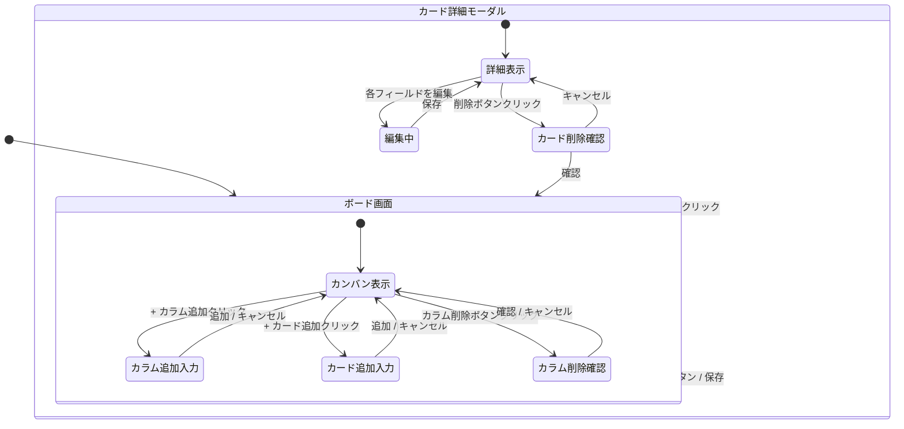
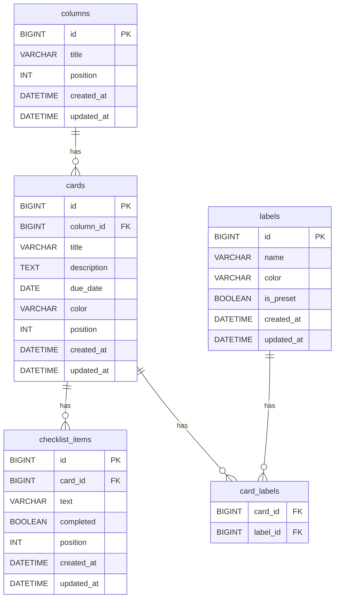

# タスク管理アプリ 要件定義書

**バージョン:** 0.4  
**作成日:** 2026-04-29  
**改訂日:** 2026-04-29  
**作成者:** tomo-taka108

---

## 改訂履歴

| バージョン | 日付 | 変更内容 |
|-----------|------|----------|
| 0.1 | 2026-04-29 | 初版作成 |
| 0.2 | 2026-04-29 | プロジェクト背景・ユーザー定義・受入条件・制約条件・スコープ外詳細を追加 |
| 0.3 | 2026-04-29 | バックエンド（Java / Spring Boot / MySQL）対応に伴う技術スタック・スコープ・制約条件更新、画面遷移図・ER図追加 |
| 0.4 | 2026-04-29 | 複数ボード対応をスコープ外に変更。ボード固定（1つ）構成に簡略化。関連する機能要件・画面構成・ER図・APIを全面見直し |

---

## 1. プロジェクト概要

### 1.1 背景・目的

本プロジェクトは、WebアプリケーションのフルスタックI開発スキルの習得を目的としたスクール課題として実施する。

課題の要件として「実用的なWebアプリを設計・実装すること」が求められており、題材としてTrelloライクなカンバン形式のタスク管理アプリを選定した。フロントエンドにReact / TypeScript、バックエンドにJava / Spring Boot、データ永続化にMySQLを用いたフルスタック構成により、REST API設計・DB設計・フロントエンド実装を一貫して実践することが本プロジェクトの主目的である。

### 1.2 ユーザー定義

| 区分 | 内容 |
|------|------|
| 利用者 | 開発者本人（個人利用） |
| 利用環境 | PCブラウザ（Chrome / Edge / Safari 最新版） |
| 利用シーン | 個人タスクの整理・進捗管理 |
| 同時利用人数 | 1名（マルチユーザー対応は対象外） |

### 1.3 スコープ

**対象:**
- カンバンボード（固定1つ）上でのカラム・カード管理
- カード詳細機能（説明・期限・ラベル・チェックリスト）
- フィルタ・検索機能
- ダークモード
- バックエンドAPI（Spring Boot）
- データベース永続化（MySQL）

**対象外（スコープ外）:**
- 複数ボード対応（ボードは1つ固定）
- ボードの作成・削除・タイトル変更
- ユーザー認証・ログイン機能
- マルチユーザー・チーム共有機能
- 外部サービス連携（通知・カレンダー等）
- モバイルアプリ（iOS / Android）
- PWA対応
- スマートフォン向けレイアウト最適化（PCおよびタブレット対応のみ）
- クラウドデプロイ（ローカル動作確認のみ、将来変更の可能性あり）

---

## 2. 技術スタック

### フロントエンド

| 区分 | 技術 |
|------|------|
| フレームワーク | React + TypeScript + Vite |
| スタイリング | Tailwind CSS |
| 状態管理 | Zustand |
| ドラッグ&ドロップ | dnd-kit |
| HTTPクライアント | Axios / Fetch API |

### バックエンド

| 区分 | 技術 |
|------|------|
| 言語 | Java |
| フレームワーク | Spring Boot |
| APIスタイル | REST API |
| DB | MySQL |
| ORM | Spring Data JPA / Hibernate |
| ビルドツール | Maven または Gradle |

---

## 3. 制約・前提条件

| 区分 | 内容 |
|------|------|
| 実行環境 | ローカル環境でフロントエンド・バックエンドを別プロセスで起動 |
| デプロイ先 | ローカル動作確認のみ（将来的にクラウドデプロイに変更の可能性あり） |
| データ保存 | MySQLによるサーバーサイド永続化。localStorageは使用しない |
| ボード | アプリ起動時にボードが1つ存在する状態を前提とする（DBの初期データとして用意） |
| セキュリティ | 個人利用かつ機密データを扱わないため、認証・暗号化は対象外 |
| OSSライセンス | 使用ライブラリはすべてMIT / Apache 2.0 等の商用利用可能なライセンスを選定する |
| ブラウザ対応 | Chrome・Edge・Safari の最新版のみ対象。IE・旧バージョンは対象外 |
| 開発期間 | 約4週間（スクール課題の提出期限に準拠） |
| CORS | フロントエンド（localhost:5173）とバックエンド（localhost:8080）間のCORSを許可設定する |

---

## 4. 機能要件

### 4.1 カラム（リスト）機能

アプリ起動時に「Todo / In Progress / Done」の3列をデフォルトで表示する。カラムは自由に追加・削除・名前変更が可能。

| ID | 機能 | 優先度 | 受入条件 |
|----|------|--------|----------|
| C-01 | カラムを追加できる | 必須 | 名前を入力して追加するとボード右端に新しいカラムが表示される |
| C-02 | カラムを削除できる | 必須 | 削除後、カラムと配下のカードがすべて消える |
| C-03 | カラム名を変更できる | 必須 | カラム名をクリック/編集して確定すると表示が更新される |
| C-04 | カラムの順序を変更できる（ドラッグ&ドロップ） | 必須 | カラムをドラッグして別の位置にドロップすると順序が変わりDBに保持される |

### 4.2 カード（タスク）機能

| ID | 機能 | 優先度 | 受入条件 |
|----|------|--------|----------|
| K-01 | カードを作成できる | 必須 | タイトルを入力して追加するとカラム末尾にカードが追加される |
| K-02 | カードを編集できる | 必須 | カードをクリックすると詳細モーダルが開き、タイトル等を編集・保存できる |
| K-03 | カードを削除できる | 必須 | 削除操作後にカードが一覧から消え、DBからも削除される |
| K-04 | カードをカラム間でドラッグ&ドロップで移動できる | 必須 | カードを別カラムにドロップすると移動し、DBのカラムIDが更新される |
| K-05 | カラム内でカードの順序を変更できる（ドラッグ&ドロップ） | 必須 | カード間にドロップすると指定した位置に挿入され順序がDBに保持される |

### 4.3 カード詳細機能

| ID | 機能 | 優先度 | 受入条件 |
|----|------|--------|----------|
| D-01 | カードに説明文を入力できる | 高 | 説明文を入力・保存するとモーダル再表示時に内容が保持されている |
| D-02 | カードに期限日（Due date）を設定できる | 高 | 日付を設定・保存するとカード一覧上に期限日が表示される |
| D-03 | 期限超過時に視覚的な警告を表示する | 中 | 期限日を過ぎたカードに赤色のバッジや警告アイコンが表示される |
| D-04 | カードにラベルを設定できる | 高 | ラベルを選択・保存するとカード上にラベルが色付きで表示される |
| D-05 | カードにチェックリスト（サブタスク）を追加できる | 中 | 項目を追加・チェックでき、完了状態がDBに保持される |
| D-06 | チェックリストの完了率をカード上に表示する | 低 | 完了率がカード一覧上にプログレスバーまたはパーセンテージで表示される |

### 4.4 ラベル機能

プリセットラベルを用意しつつ、ユーザーが独自のラベルを追加作成できる。ラベルはアプリ全体で共通管理する（ボード単位の管理は不要）。

| ID | 機能 | 優先度 | 受入条件 |
|----|------|--------|----------|
| L-01 | プリセットラベルを選択できる | 高 | 定義済みの色・名前のラベルをカードに付与できる |
| L-02 | カスタムラベルを名前・色指定で作成できる | 中 | 名前と色を指定して作成するとラベル一覧に追加され、カードに付与できる |
| L-03 | カスタムラベルを編集・削除できる | 中 | 編集後に名前・色が反映され、削除後は該当カードからも除去される |

### 4.5 フィルタ・検索機能

| ID | 機能 | 優先度 | 受入条件 |
|----|------|--------|----------|
| F-01 | キーワードでカードを検索できる | 中 | 検索バーに入力するとタイトル・説明文にマッチするカードのみ表示される |
| F-02 | ラベルでカードをフィルタリングできる | 中 | ラベルを選択するとそのラベルを持つカードのみ表示される |
| F-03 | 期限日でカードをフィルタリングできる | 低 | 「期限超過」「今週中」等の条件でカードを絞り込める |

### 4.6 UI/UX機能

| ID | 機能 | 優先度 | 受入条件 |
|----|------|--------|----------|
| U-01 | ダークモード / ライトモードを切り替えられる | 中 | 切り替えボタンで即座にテーマが変わり、設定がlocalStorageに保持される |
| U-02 | カードの色を設定できる | 低 | カードの背景色を選択すると一覧上で反映される |
| U-03 | レスポンシブデザイン（PC・タブレット対応） | 中 | タブレット幅（768px以上）でレイアウトが崩れず使用できる |

---

## 5. 非機能要件

| 区分 | 要件 |
|------|------|
| パフォーマンス | カードが100枚以下であればストレスなく動作すること |
| データ永続化 | アプリを再起動してもDBのデータが保持されること |
| ブラウザ対応 | Chrome・Edge・Safariの最新版をサポート |
| アクセシビリティ | キーボード操作でカードの作成・削除が可能なこと |
| API | RESTful設計に従い、HTTPステータスコードを適切に返すこと |

---

## 6. 画面構成・画面遷移図

### 6.1 画面一覧

| 画面ID | 画面名 | 概要 |
|--------|--------|------|
| S-01 | ボード画面 | カラム・カードを表示するメイン操作画面。アプリ起動時に直接表示される |
| S-02 | カード詳細モーダル | カードの詳細情報（説明・期限・ラベル・チェックリスト）を表示・編集するモーダル |

### 6.2 画面遷移図



### 6.3 画面レイアウト

```
[ボード画面]
┌──────────────────────────────────────────────────────────┐
│  ヘッダー: アプリ名 | 検索バー | フィルタ | ダークモード切替 │
├──────────────────────────────────────────────────────────┤
│                                                          │
│  ┌──────────┐  ┌──────────┐  ┌──────────┐  ┌───┐       │
│  │ Todo     │  │In Progress│  │ Done     │  │ + │       │
│  │──────────│  │──────────│  │──────────│  └───┘       │
│  │ [カード] │  │ [カード] │  │ [カード] │              │
│  │ [カード] │  │          │  │          │              │
│  │ + 追加   │  │ + 追加   │  │ + 追加   │              │
│  └──────────┘  └──────────┘  └──────────┘              │
│                                                          │
└──────────────────────────────────────────────────────────┘

[カード詳細モーダル]
┌──────────────────────────────┐
│ タイトル（編集可）           │
│──────────────────────────────│
│ 説明文                       │
│ 期限日: 2026-05-01  ⚠️       │
│ ラベル: [🔴 Bug] [🟢 Feature]│
│ チェックリスト               │
│  ☑ サブタスク1              │
│  ☐ サブタスク2              │
│ 完了率: 50%                  │
│──────────────────────────────│
│               [削除] [閉じる]│
└──────────────────────────────┘
```

---

## 7. データモデル・ER図

### 7.1 ER図



### 7.2 テーブル補足

| テーブル | 補足 |
|----------|------|
| columns | ボード固定のため board_id は不要。並び順は `position` で管理 |
| cards | 所属カラムを `column_id` で管理。カラム移動時に `column_id` と `position` を更新 |
| labels | アプリ全体で共通管理。`is_preset = true` はプリセットラベル |
| card_labels | カードとラベルの多対多を解消する中間テーブル |
| checklist_items | カード単位で管理。並び順は `position` で管理 |

---

## 8. API設計概要

| メソッド | エンドポイント | 概要 |
|----------|---------------|------|
| GET | /api/columns | カラム一覧取得 |
| POST | /api/columns | カラム作成 |
| PUT | /api/columns/{id} | カラム更新 |
| DELETE | /api/columns/{id} | カラム削除 |
| PUT | /api/columns/reorder | カラム並び替え |
| GET | /api/columns/{id}/cards | カード一覧取得 |
| POST | /api/columns/{id}/cards | カード作成 |
| GET | /api/cards/{id} | カード詳細取得 |
| PUT | /api/cards/{id} | カード更新 |
| DELETE | /api/cards/{id} | カード削除 |
| PUT | /api/cards/{id}/move | カード移動（カラム間・並び替え） |
| GET | /api/labels | ラベル一覧取得 |
| POST | /api/labels | ラベル作成 |
| PUT | /api/labels/{id} | ラベル更新 |
| DELETE | /api/labels/{id} | ラベル削除 |
| POST | /api/cards/{id}/checklist | チェックリスト項目追加 |
| PUT | /api/checklist/{id} | チェックリスト項目更新 |
| DELETE | /api/checklist/{id} | チェックリスト項目削除 |

---

## 9. 開発フェーズ案

| フェーズ | 内容 | 目安 |
|----------|------|------|
| Phase 1 | プロジェクトセットアップ（Vite + Spring Boot + MySQL環境構築） | Week 1 |
| Phase 2 | カラム・カードの基本CRUD（API + フロントエンド） | Week 1-2 |
| Phase 3 | ドラッグ&ドロップ実装（カラム・カード移動） | Week 2-3 |
| Phase 4 | カード詳細（説明・期限・ラベル・チェックリスト） | Week 3 |
| Phase 5 | フィルタ・検索・ダークモード | Week 3-4 |
| Phase 6 | テスト・バグ修正・UI調整 | Week 4 |
