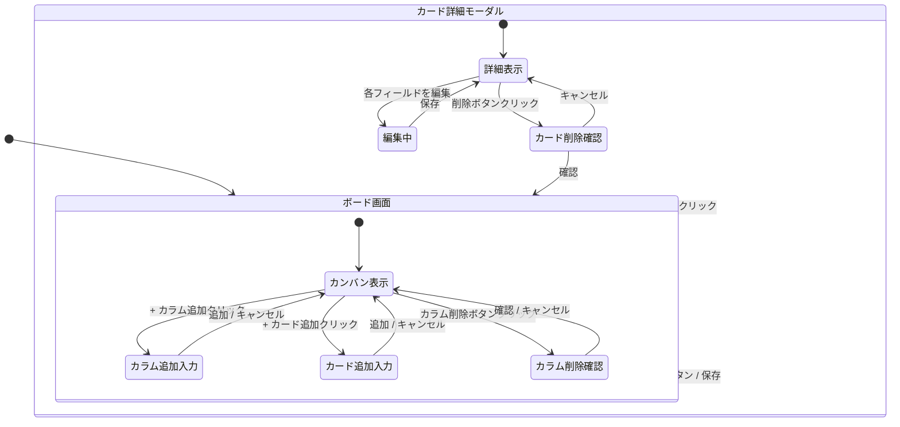

# 画面設計書

**バージョン:** 0.2  
**作成日:** 2026-06-13  
**改訂日:** 2026-06-28  
**作成者:** tomo-taka108

---

## 1. 画面一覧

| 画面ID | 画面名 | 概要 |
|--------|--------|------|
| S-01 | ボード画面 | カラム・カードを表示するメイン操作画面。アプリ起動時に直接表示される |
| S-02 | カード詳細モーダル | カードの詳細情報（説明・期限・ラベル・チェックリスト）を表示・編集するモーダル |

---

## 2. 画面遷移図



---

## 3. 画面レイアウト

### 3.1 ボード画面（S-01）

```
┌──────────────────────────────────────────────────────────┐
│  ヘッダー: アプリ名 | 検索バー | フィルタ | ダークモード切替 │
├──────────────────────────────────────────────────────────┤
│                                                          │
│  ┌──────────┐  ┌──────────┐  ┌──────────┐  ┌───┐       │
│  │ 未着手   │  │ 作業中    │  │ 完了     │  │ + │       │
│  │──────────│  │──────────│  │──────────│  └───┘       │
│  │ [カード] │  │ [カード] │  │ [カード] │              │
│  │ [カード] │  │          │  │          │              │
│  │ + 追加   │  │ + 追加   │  │ + 追加   │              │
│  └──────────┘  └──────────┘  └──────────┘              │
│                                                          │
└──────────────────────────────────────────────────────────┘
```

**ヘッダー要素:**
- アプリ名（左端）
- 検索バー（キーワード検索）
- フィルタ（ラベル・期限日によるフィルタリング）
- ダークモード切替ボタン（右端）

**ボードエリア要素:**
- カラム（横スクロール対応）
- 各カラムにカード一覧と「+ カード追加」ボタン
- ボード右端に「+ カラム追加」ボタン

**カード追加フォーム要素（「+ カード追加」クリック時にカラム内に展開）:**
- タイトル（テキスト入力・必須）
- 説明（テキストエリア・任意）
- 優先度（セレクトボックス：高・中・低・なし）
- 期限日（日付ピッカー・任意）
- 「カードを追加」ボタン・「キャンセル」ボタン

### 3.2 カード詳細モーダル（S-02）

```
┌──────────────────────────────┐
│ [カラム名]          [✕閉じる]│
│ タイトル（編集可）           │
│──────────────────────────────│
│ 説明文（テキストエリア）     │
│ 優先度: [高▼]               │
│ 期限日: [2026-05-01]         │
│ ラベル: [🔴 Bug] [🟢 Feature]│
│──────────────────────────────│
│ [削除]    [キャンセル] [保存]│
└──────────────────────────────┘

※削除ボタンクリック時、モーダル上に確認ダイアログを重ねて表示:
┌──────────────────────┐
│ このカードを削除しますか？    │
│ 「タイトル」を削除します。   │
│ この操作は元に戻せません。   │
│       [キャンセル] [削除する]│
└──────────────────────┘
```

**モーダル要素:**
- カラム名（読み取り専用・ヘッダー左上）
- タイトル（インライン編集）
- 説明文（テキストエリア）
- 優先度（セレクトボックス：高・中・低・なし）
- 期限日ピッカー
- ラベル表示（読み取り専用・ラベルが1件以上ある場合のみ表示）
- 削除ボタン（赤・左下）・キャンセルボタン・保存ボタン（右下）
- 削除確認ダイアログ（削除ボタンクリック時にモーダル上に重ねて表示）
